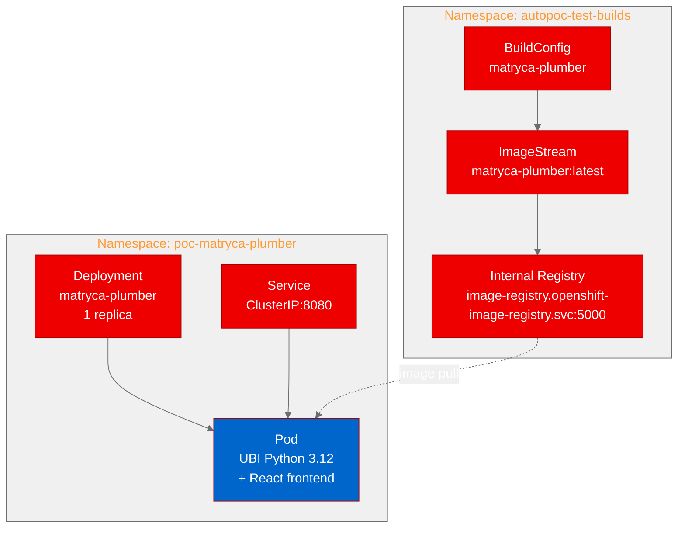

# PoC Report: matryca-plumber

## Executive Summary

**Matryca Plumber** was successfully deployed on OpenShift as a containerized web application. The PoC validated that the FastAPI-based Sovereign UI, including its React 19 frontend dashboard, can run on OpenShift using UBI-based container images with all 4 test scenarios passing (100% pass rate).

| Metric | Value |
|---|---|
| **Project** | matryca-plumber v2.0.0-alpha.5 |
| **PoC Type** | web-app (FastAPI + React) |
| **Tests Passed** | 4/4 (100%) |
| **Build Retries** | 1 (permission fix in Node.js stage) |
| **Deploy Retries** | 0 |
| **Total Pipeline Time** | ~15 minutes |

## Project Analysis

| Field | Value |
|---|---|
| **Source** | [MarcoPorcellato/matryca-plumber](https://github.com/MarcoPorcellato/matryca-plumber) |
| **Fork** | [aicatalyst-team/matryca-plumber](https://github.com/aicatalyst-team/matryca-plumber) |
| **License** | Apache-2.0 |
| **Language** | Python 3.12+ (FastAPI/Uvicorn), TypeScript/React 19 (Vite) |
| **Tests** | 1139+ passing, 70%+ coverage |
| **Published** | PyPI (matryca-plumber) |

### Component Table

| Component | Language | Build System | Entry Point | Port |
|---|---|---|---|---|
| matryca-plumber | Python + TypeScript | pip + npm | `src.cli.ui_server:app` | 8080 |

### Key Features Deployed

- **Sovereign UI** — FastAPI web dashboard with React 19 frontend
- **REST API** — Health check, preflight, configuration, daemon control endpoints
- **MCP Server** — FastMCP stdio integration for AI agent tool connectivity
- **Background Daemon** — Maintenance daemon for Logseq graph operations

## PoC Objectives

1. Containerize the application using UBI-based multi-stage Dockerfile
2. Build and deploy to OpenShift using internal registry
3. Validate the Sovereign UI web interface accessibility
4. Verify API endpoint functionality (health, preflight, config)

## Pipeline Execution Summary

```mermaid
%%{init: {'theme': 'base', 'themeVariables': {'primaryColor': '#EE0000', 'primaryTextColor': '#fff', 'primaryBorderColor': '#A30000', 'lineColor': '#6A6E73', 'secondaryColor': '#F0F0F0', 'tertiaryColor': '#0066CC'}}}%%
flowchart LR
    A[Phase 1<br>Intake] -->|completed| B[Phase 2<br>Evaluate]
    B -->|completed| C[Phase 3<br>Fork]
    C -->|completed| D[Phase 4<br>PoC Plan]
    D -->|completed| E[Phase 5<br>Containerize]
    E -->|retry 1| E
    E -->|completed| F[Phase 6<br>Build]
    F -->|completed| G[Phase 7<br>Deploy]
    G -->|completed| H[Phase 8<br>Apply]
    H -->|completed| I[Phase 9<br>Test]
    I -->|4/4 pass| J[Phase 10<br>Report]
    J -->|completed| K[Phase 11<br>Blog]

    style A fill:#0066CC,color:#fff
    style I fill:#00A86B,color:#fff
    style K fill:#EE0000,color:#fff
```

### Phase Details

| Phase | Status | Duration | Notes |
|---|---|---|---|
| 1. Intake | Completed | ~1 min | Single component identified (Python + React) |
| 2. Evaluate | Completed | ~1 min | Score: 28.5/40, adjacent relationship |
| 3. Fork | Completed | ~1 min | Existing AutoPoC fork synced |
| 4. PoC Plan | Completed | ~1 min | web-app type, 4 test scenarios |
| 5. Containerize | Completed | ~2 min | Multi-stage UBI Dockerfile (1 retry) |
| 6. Build | Completed | ~5 min | OpenShift binary build, internal registry |
| 7. Deploy | Completed | ~1 min | Deployment + Service manifests |
| 8. Apply | Completed | ~3 min | ImagePull resolved with dockercfg secret |
| 9. PoC Execute | Completed | ~1 min | 4/4 scenarios passed |
| 10. Report | Completed | - | This document |
| 11. Blog | Pending | - | - |

### Build Details

**Strategy**: OpenShift binary build (`oc start-build --from-dir`)

**Multi-stage Dockerfile**:
- Stage 1: `registry.access.redhat.com/ubi9/nodejs-22` — Frontend build (npm ci + vite build)
- Stage 2: `registry.access.redhat.com/ubi9/python-312` — Python runtime with built frontend assets

**Build Retry**: First build failed with `EACCES` permission error in the Node.js stage (`mkdir /opt/app-root/src/frontend/node_modules`). Fixed by using the default WORKDIR `/opt/app-root/src` which has correct permissions for the UBI nodejs-22 image user.

**Image**: `image-registry.openshift-image-registry.svc:5000/autopoc-test-builds/matryca-plumber:latest`

## Test Results

| Scenario | Status | HTTP Code | Response Time | Details |
|---|---|---|---|---|
| Health Check | PASS | 200 | 0.02s | `{"status": "ok"}` |
| Homepage Dashboard | PASS | 200 | <0.01s | React SPA served (832 bytes HTML) |
| API Preflight | PASS | 200 | 0.01s | Returns preflight checks (expected failures for unconfigured graph) |
| API Config | PASS | 200 | <0.01s | Full configuration object returned |

### Authentication

The Sovereign UI uses a custom `x-matryca-token` header for API authentication when `MATRYCA_UI_ALLOW_LAN=1`. The health endpoint (`/api/health`) is exempt from auth. The PoC configured `MATRYCA_UI_TOKEN=poc-demo-token-2026` as the auth token.

## Infrastructure Deployed

### Resources

| Resource | Namespace | Details |
|---|---|---|
| Deployment/matryca-plumber | poc-matryca-plumber | 1 replica, 100m-500m CPU, 256Mi-512Mi RAM |
| Service/matryca-plumber | poc-matryca-plumber | ClusterIP, port 8080 |
| BuildConfig/matryca-plumber | autopoc-test-builds | Binary Docker strategy |
| ImageStream/matryca-plumber | autopoc-test-builds | Internal registry |

## Recommendations

### For Production Deployment

1. **Persistent Storage**: Mount a PVC for the Logseq graph directory (`LOGSEQ_GRAPH_PATH`) if real graph operations are needed.
2. **Route/Ingress**: Create an OpenShift Route or Ingress for external access to the Sovereign UI.
3. **Auth Token**: Use a proper secret for `MATRYCA_UI_TOKEN` instead of a static value.
4. **Enable Docs**: Set `MATRYCA_UI_ENABLE_DOCS=1` if the OpenAPI/Swagger UI is desired.
5. **Resource Tuning**: The small resource profile (256Mi-512Mi) is sufficient for the UI server; increase if running daemon workloads.

### OpenShift AI / ODH Considerations

- **MCP Server**: The project's MCP server capability aligns with the Red Hat AI agentic strategy. An MCP-compatible deployment pattern could be developed for OpenShift AI.
- **Agent Integration**: The tool connectivity via MCP protocol makes this a candidate for integration with Llama Stack or other agentic runtimes on the platform.
- **No GPU Required**: This is a lightweight web application with no inference or model-serving requirements.

## Appendix

### Artifact Links

| Artifact | Location |
|---|---|
| Source Repository | https://github.com/MarcoPorcellato/matryca-plumber |
| Fork (AutoPoC) | https://github.com/aicatalyst-team/matryca-plumber |
| Artifacts Branch | `autopoc-artifacts` on fork |
| Dockerfile | `Dockerfile.ubi` in repo root |
| K8s Manifests | `kubernetes/` directory |
| PoC Plan | `poc-plan.md` |
| Test Script | `poc_test.py` |
| RHOAI Evaluation | `.autopoc/rhoai-evaluation.md` |
| State File | `/tmp/autopoc/matryca-poc-state.yaml` |

### Environment

| Variable | Value |
|---|---|
| Build Namespace | autopoc-test-builds |
| Deploy Namespace | poc-matryca-plumber |
| Container Image | `image-registry.openshift-image-registry.svc:5000/autopoc-test-builds/matryca-plumber:latest` |
| Container Port | 8080 |
| Base Images | UBI 9 Python 3.12 + UBI 9 Node.js 22 |
